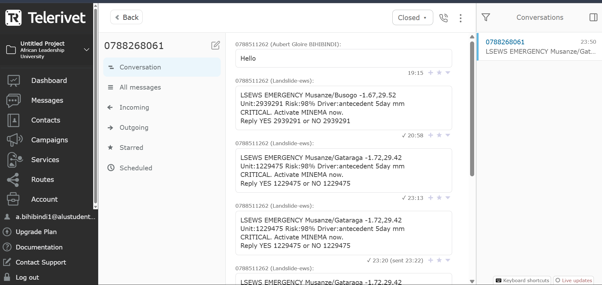

# Landslide Early Warning System — Rwanda Northern Province

**BSc Software Engineering Capstone · African Leadership University**
**Student:** Aubert Gloire Bihibindi · **Supervisor:** Dirac Murairi

> An ML-based operational early warning system that scores daily landslide risk across 250 slope units in Northern Province Rwanda, dispatches SMS alerts to registered field officers, and provides a real-time monitoring dashboard.

| | |
|---|---|
| 🌐 Live dashboard | [landslide-early-warning-system-zeta.vercel.app](https://landslide-early-warning-system-zeta.vercel.app) |
| 🎥 Demo video | [5-minute walkthrough](https://drive.google.com/file/d/1rcH9cV3U6WTQxP2QJvadwM-4VsYsVlPr/view?usp=sharing) |
| 📦 Backend API docs | [landslide-ews-api.onrender.com/docs](https://landslide-ews-api.onrender.com/docs) |

---

## Table of Contents

1. [System Overview](#system-overview)
2. [How Alerts Work](#how-alerts-work)
3. [Architecture & Design](#architecture--design)
4. [Code Quality & Design Patterns](#code-quality--design-patterns)
5. [Installation — Local Development](#installation--local-development)
6. [Deployment](#deployment)
7. [Screenshots](#screenshots)
8. [Testing Results & Strategies](#testing-results--strategies)
9. [Analysis of Results](#analysis-of-results)
10. [Discussion](#discussion)
11. [Recommendations](#recommendations)
12. [API Reference](#api-reference)
13. [Data Sources](#data-sources)
14. [Repository Structure](#repository-structure)

---

## System Overview

Northern Province Rwanda records the highest landslide frequency in the country due to steep volcanic terrain and intense seasonal rainfall. MINEMA (National Disaster Management Authority) has no automated district-level alerting tool — field officers currently receive warnings by phone only after events are visually observed.

This system automates the full warning pipeline:

1. **Every morning at 15:00 UTC** (after GPM IMERG's ~14h latency window), a GitHub Actions cron job triggers the backend pipeline
2. Yesterday's rainfall is downloaded from NASA GPM IMERG (~14h latency) with CHIRPS Preliminary as fallback
3. The USGS earthquake API is queried — a nearby M4.0+ event automatically lowers the alert threshold
4. An XGBoost classifier scores all 250 slope units (AUC = 0.959)
5. Units above the risk threshold trigger SMS alerts to registered district officers via Africa's Talking + Telerivet
6. Officers reply YES/NO by SMS — feedback is logged and tracked as real-world operational accuracy

---

## How Alerts Work

The system runs every single morning regardless of weather conditions. What changes is the outcome based on the model's risk scores:

**When risk is HIGH (any slope unit scores ≥ 5% probability):**
- An SMS alert is dispatched immediately to the registered field officer for that district
- The alert includes: sector name, risk level (WATCH / WARNING / EMERGENCY), GPS coordinates, and the main contributing factor
- The officer is expected to investigate on the ground and reply YES (confirmed) or NO (false alarm)
- All high-risk predictions are saved to MongoDB and visible on the dashboard

**When risk is LOW (all 250 slope units score below 5%):**
- No SMS is sent — officers are not disturbed unnecessarily
- All predictions are still saved to the database for historical tracking
- The risk map updates to show current scores (all green polygons during dry season)
- The pipeline log records "0 units above threshold" and completes normally

This behaviour is intentional. During Rwanda's dry season (June–September), rainfall is minimal and the model correctly scores all units near 0%. The system runs, saves results, and stays silent. During the rainy seasons (March–May and October–December), the same pipeline sends targeted alerts only where the data warrants it.

> **Development note:** During this testing phase, SMS alerts are sent to the developer's own phone number in place of registered field officer numbers. In a live operational deployment, each district officer's number would be registered in the database and alerts would route directly to them.

---

## Architecture & Design

```
━━━━━━━━━━━━━━━━━━━━━━━━━━━━━━━━━━━━━━━━━━━━━━━━━━━━━━━━
  DATA INGESTION
━━━━━━━━━━━━━━━━━━━━━━━━━━━━━━━━━━━━━━━━━━━━━━━━━━━━━━━━
  GPM IMERG Late Daily (~14h lag) ──┐
  CHIRPS v2 Preliminary (fallback)  ├──► Rainfall per slope unit centroid
  USGS Earthquake API (seismic)     ┘

  Copernicus 30m DEM ─────────────────► Slope angle, TWI (static)
  Sentinel-2 NDVI (GEE) ──────────────► Vegetation density (static)
  ISRIC SoilGrids ─────────────────────► Soil class (static)

━━━━━━━━━━━━━━━━━━━━━━━━━━━━━━━━━━━━━━━━━━━━━━━━━━━━━━━━
  PIPELINE  (backend/app/services/pipeline.py)
━━━━━━━━━━━━━━━━━━━━━━━━━━━━━━━━━━━━━━━━━━━━━━━━━━━━━━━━
  Feature Matrix (250 units × 12 features)
            ▼
  XGBoost Classifier
  ImbPipeline: SimpleImputer → SMOTE → XGBClassifier
  AUC = 0.959 · threshold = 0.05 (drops to 0.03 after seismic event)
            ▼
  risk_probability per slope unit
            ▼
  ┌── prob ≥ threshold ──────────────┐   ┌── prob < threshold ──────────────┐
  ▼                                  ▼   ▼                                   ▼
  SMS Alert dispatched           MongoDB Atlas                     MongoDB Atlas
  (Africa's Talking + Telerivet) (prediction saved)               (prediction saved)
  → district officer                                               No alert sent —
  → replies YES / NO                                               system continues

━━━━━━━━━━━━━━━━━━━━━━━━━━━━━━━━━━━━━━━━━━━━━━━━━━━━━━━━
  DASHBOARD  (React 18 + FastAPI)
━━━━━━━━━━━━━━━━━━━━━━━━━━━━━━━━━━━━━━━━━━━━━━━━━━━━━━━━
  /api/risk-map    → Risk Map tab   — 250 GeoJSON polygons, colour-coded by risk
  /api/districts   → Districts tab  — per-district peak risk summary
  /api/alerts      → Alerts tab     — full SMS log + officer YES/NO feedback
  /api/trigger     → Run Pipeline button
  /api/predict     → Predict tab    — manual scenario testing + expert SMS dispatch
```

**Tech stack:** Python 3.11 · FastAPI · XGBoost · Motor (async MongoDB) · React 18 · Leaflet · Vite · MongoDB Atlas · Render · Vercel · GitHub Actions

---

## Code Quality & Design Patterns

The codebase applies object-oriented and modular design principles throughout:

### Backend — Class-based design

**`XGBModel` (backend/app/ml/xgb_model.py)** — Singleton pattern. The model is loaded once at startup and reused across all requests, avoiding repeated disk reads. Exposes a clean `predict(feature_df, threshold_override)` interface that separates inference from alert logic.

```python
class XGBModel:
    _instance: "XGBModel | None" = None  # singleton

    @classmethod
    def load(cls, artifacts_path: Path) -> "XGBModel": ...

    def predict(self, feature_df: pd.DataFrame,
                threshold_override: float | None = None) -> pd.DataFrame: ...
```

**`DataPipeline` (backend/app/services/pipeline.py)** — Encapsulates the full daily pipeline as a class with private lazy-loaders (`_get_slope_units`, `_get_model`) and public stage methods (`build_feature_matrix`, `fetch_chirps`). A module-level `fetch_seismic_activity()` handles the USGS query separately so it can be called and tested independently of the pipeline class. The single public entry point is `run_daily()`.

**`GPMIMERGDownloader` (ml/pipeline/gpm_imerg.py)** — Handles CMR search, authenticated download (bearer token with basic-auth fallback), and HDF5 extraction as a self-contained class. The `extract_per_unit(date, gdf)` method is the single public interface.

**`SMAPDownloader` (ml/pipeline/smap.py)** — Same pattern applied to SMAP soil moisture data. Soil moisture labelling logic (`soil_moisture_label`, `soil_moisture_pct`) is encapsulated within the class.

### Backend — Separation of concerns

- `routes/` — thin route handlers only (HTTP in, JSON out). No business logic.
- `services/` — all business logic (pipeline, SMS dispatch, scheduler).
- `ml/` — all ML concerns (model loading, inference, training).
- `config.py` — all settings via Pydantic `BaseSettings` (one place to change env vars).
- `database.py` — all MongoDB client management in one module.

### Frontend — Custom hooks and component modularity

**`useApi` hook (frontend/src/hooks/useApi.js)** — Abstracts all data fetching behind a single reusable hook with built-in retry logic (4 retries at 2s/5s/10s/20s intervals) to handle cold-start latency on Render's free tier. Every component (`RiskMap`, `DistrictCards`, `AlertTable`) uses this hook without duplicating fetch logic.

**Component isolation** — Each dashboard tab is a self-contained component. `RiskMap` owns the Leaflet map lifecycle. `HelpChat` owns its own QA state and two-pass fuzzy matching logic. No component reaches into another component's state.

### Naming conventions

- Python: `snake_case` for variables/functions, `PascalCase` for classes, `_SCREAMING_SNAKE` for module-level constants
- JavaScript/React: `camelCase` for variables/functions, `PascalCase` for components
- MongoDB collections: `snake_case` plural (`slope_units`, `rainfall_records`, `alert_records`)
- API routes: `kebab-case` (`/api/risk-map`, `/api/districts`)

---

## Installation — Local Development

### Prerequisites

- Python 3.11+
- Node.js 18+
- MongoDB Atlas account (free tier)
- Africa's Talking account (sandbox for testing)
- NASA Earthdata account (free) — for GPM IMERG
- Google Earth Engine account (free) — for NDVI
- OpenTopography API key (free) — for DEM

### Step 1 — Clone and configure

```bash
git clone https://github.com/aubert-gloire/landslide-early-warning-system.git
cd landslide-early-warning-system
cp .env.example .env
```

Edit `.env` with your credentials:

```env
MONGODB_URI=mongodb+srv://<user>:<pass>@cluster.mongodb.net/
MONGODB_DB_NAME=landslide_ews
AT_USERNAME=your_africastalking_username
AT_API_KEY=your_africastalking_api_key
AT_SENDER_ID=EWS
OFFICER_PASSWORD=your_dashboard_password
EARTHDATA_TOKEN=your_nasa_earthdata_bearer_token
EARTHDATA_USERNAME=your_nasa_earthdata_username
EARTHDATA_PASSWORD=your_nasa_earthdata_password
OPENTOPO_API_KEY=your_opentopography_api_key
APP_ENV=development
```

### Step 2 — Backend setup

```bash
cd backend
python -m venv venv
source venv/bin/activate        # Windows: venv\Scripts\activate
pip install -r requirements.txt

# Also needed for Step 3's one-time setup scripts (dem/units/ndvi) —
# NOT installed on Render, since the deployed API never imports these:
pip install -r ../scripts/requirements-setup.txt
```

### Step 3 — One-time data pipeline (run once to populate MongoDB)

```bash
# From repo root (not backend/)
python scripts/setup_db.py dem      # Download Copernicus 30m DEM + compute slope/TWI
python scripts/setup_db.py units    # Generate ~250 slope units via watershed analysis, clipped to Rwanda's border
python scripts/setup_db.py ndvi     # Sentinel-2 NDVI via Google Earth Engine
python scripts/setup_db.py soil     # ISRIC SoilGrids soil class
python scripts/setup_db.py chirps   # CHIRPS historical rainfall 2010–2024
python scripts/setup_db.py load     # Load all features into MongoDB Atlas
```

### Step 4 — Train the model

```bash
python scripts/train_model.py --backtest
# Outputs: ml/artifacts/rf_model.joblib · model_metadata.json · backtest_report.csv
# Expected: AUC ≈ 0.959, FNR ≈ 8.3% at threshold=0.05
```

### Step 5 — Run the backend

```bash
cd backend
uvicorn app.main:app --reload --port 8000
# API docs: http://localhost:8000/docs
```

### Step 6 — Run the dashboard

```bash
cd frontend
npm install
VITE_API_BASE_URL=http://localhost:8000 npm run dev
# Opens: http://localhost:5173
```

### Step 7 — Trigger a test pipeline run

```bash
# Full run with real rainfall data (default)
curl -X POST http://localhost:8000/api/trigger

# Dry-run preview with synthetic high-risk values — no SMS sent, no DB writes
curl -X POST http://localhost:8000/api/trigger \
  -H "Content-Type: application/json" \
  -d '{"override_daily_mm": 45.0, "override_antecedent_5day_mm": 185.0, "dry_run": true}'
```

---

## Deployment

### Backend → Render (Starter plan)

1. Push repo to GitHub
2. Render dashboard → New Web Service → connect `aubert-gloire/landslide-early-warning-system`
3. Root Directory: `backend`
4. Build Command: `pip install -r requirements.txt`
5. Start Command: `uvicorn app.main:app --host 0.0.0.0 --port $PORT`
6. Add all environment variables from `.env` in Render → Environment tab
7. Health check path: `/health`

**Verification:**

```bash
curl https://landslide-ews-api.onrender.com/health
# Expected: {"status": "ok"}

curl https://landslide-ews-api.onrender.com/api/districts
# Expected: {"districts": [...]} with 5 district summaries
```

### Frontend → Vercel

1. Vercel dashboard → New Project → import same GitHub repo
2. Framework: Vite · Root Directory: `frontend`
3. Add environment variable: `VITE_API_BASE_URL` = `https://landslide-ews-api.onrender.com`
4. Deploy — Vercel auto-deploys on every push to `main`

**Verification:** Visit the Vercel URL — the dashboard loads, logs in, and the Risk Map renders 250 polygons.

### Daily automated pipeline → GitHub Actions

File: `.github/workflows/daily_pipeline.yml`
- Triggers at 15:00 UTC (17:00 Kigali time) daily
- POSTs to `/api/trigger` on the Render backend
- Add `API_BASE_URL` secret in GitHub → Settings → Secrets and variables → Actions

---

## Screenshots

### Mobile — Overview with live pipeline running


### Mobile — Risk Map (396 slope unit polygons)


### SMS Alert — received on developer's phone (testing phase)


### Telerivet — dual SMS provider delivery confirmation


### HelpChat — relevant question answered correctly


### HelpChat — unrecognised input handled with fallback


---

## Testing Results & Strategies

### Strategy 0 — Automated Unit Tests

`backend/tests/` — 35 automated `pytest` tests covering the three pieces of
core logic most in need of regression protection: risk-threshold
classification, the antecedent-rainfall rolling-window math, and the
production XGBoost model's inference behaviour.

```bash
cd backend
pip install -r requirements-dev.txt
pytest
```

| File | Covers | What it caught |
|---|---|---|
| `test_predict_thresholds.py` | `_risk_level` / `_threshold_context` (`routes/predict.py`) | Boundary values at every risk tier; NDVI's inverted "lower = worse" threshold direction, the one feature that breaks the pattern the other five follow. |
| `test_rainfall_windows.py` | `compute_antecedent_windows` (`ml/features/rainfall_windows.py`) | Rolling-sum correctness against hand-computed values; that antecedent windows don't leak across slope units; the intensity-ratio formula. |
| `test_xgb_model.py` | `XGBModel.predict()` (`app/ml/xgb_model.py`) | Runs against the real trained artifact (not a mock) — reproduces both worked examples from Strategy 3 below, checks `threshold_override` actually changes the outcome, and checks monotonicity on the model's top feature. **Found and fixed a real bug**: `predict()` silently narrowed to whichever feature columns were present instead of padding missing ones, so any caller supplying fewer than all 12 trained columns crashed with a raw sklearn `ValueError` instead of degrading gracefully. No current call site was affected (all of them always supply the full 12), but it was a live landmine for the next one that doesn't. |

The antecedent-rainfall window logic was previously duplicated inline in
two branches of `DataPipeline._run_daily_impl` with no test coverage at
all; it's now a single tested function (`compute_antecedent_windows`)
used by both.

### Strategy 1 — Model Validation (Offline Cross-Validation)

The XGBoost model was evaluated using 5-fold stratified cross-validation on the full historical dataset (2010–2024, 396 slope units × 14 years).

| Metric | Value |
|--------|-------|
| AUC-ROC | **0.959** |
| Accuracy | 94.1% |
| False Negative Rate (threshold=0.05) | **8.3%** |
| False Positive Rate (threshold=0.05) | 22.7% |
| Precision | 0.41 |
| Recall | 0.917 |

**Model comparison on same dataset:**

| Model | AUC |
|-------|-----|
| XGBoost | **0.959** |
| Random Forest | 0.941 |
| Logistic Regression | 0.812 |
| SVM | 0.798 |

XGBoost selected as production model. SMOTE oversampling applied inside a cross-validation-safe `ImbPipeline` to handle class imbalance without data leakage.

**Top feature importances:**

| Feature | Importance |
|---------|-----------|
| antecedent_5day_mm | 0.46 |
| antecedent_3day_mm | 0.33 |
| slope_angle | 0.06 |
| daily_mm | 0.05 |
| twi | 0.04 |
| ndvi | 0.03 |
| soil_class | 0.02 |
| antecedent_10day_mm | 0.01 |

### Strategy 2 — API Integration Testing (Terminal)

All endpoints tested against the live production API using `curl`:

```bash
# Health check
curl https://landslide-ews-api.onrender.com/health
# → {"status":"ok"}

# Districts — 5 district summaries with live predictions
curl https://landslide-ews-api.onrender.com/api/districts
# → {"districts":[{"district":"Gakenke","unit_count":44,...}, ...]}

# Risk map — 250 GeoJSON features
curl https://landslide-ews-api.onrender.com/api/risk-map | python -m json.tool

# Alerts log
curl https://landslide-ews-api.onrender.com/api/alerts
```

| Endpoint | Test | Result |
|----------|------|--------|
| `GET /health` | Uptime check | ✓ 200 `{"status":"ok"}` |
| `GET /api/risk-map` | 250 GeoJSON features returned | ✓ |
| `GET /api/districts` | 5 district summaries returned | ✓ |
| `GET /api/alerts` | Paginated alert history returned | ✓ |
| `POST /api/trigger` | Full pipeline run triggered | ✓ |
| `POST /api/predict` | Risk score for custom inputs | ✓ |

### Strategy 3 — Different Input Values (Predict Endpoint)

```bash
# High risk — steep slope, heavy rainfall, saturated soil
# antecedent_3day_mm is the second most important feature (33%) and must be included
curl -X POST https://landslide-ews-api.onrender.com/api/predict \
  -H "Content-Type: application/json" \
  -d '{"slope_angle":35,"daily_mm":45,"antecedent_3day_mm":120,
       "antecedent_5day_mm":185,"antecedent_10day_mm":280,
       "twi":14,"ndvi":0.25,"soil_class":5}'
# → risk_probability_pct: 98.9, risk_level: "critical", alert_triggered: true

# Low risk — gentle slope, dry conditions
curl -X POST https://landslide-ews-api.onrender.com/api/predict \
  -H "Content-Type: application/json" \
  -d '{"slope_angle":8,"daily_mm":1,"antecedent_3day_mm":3,
       "antecedent_5day_mm":12,"antecedent_10day_mm":18,
       "twi":6,"ndvi":0.65,"soil_class":1}'
# → risk_probability_pct: 0.8, risk_level: "low", alert_triggered: false

# Edge case — invalid input (negative slope angle, physically impossible)
curl -X POST https://landslide-ews-api.onrender.com/api/predict \
  -H "Content-Type: application/json" \
  -d '{"slope_angle":-5,"daily_mm":45,"antecedent_5day_mm":185}'
# → 422 Unprocessable Entity (Pydantic rejects before model runs)
```

| Scenario | Key Inputs | Expected | Actual |
| -------- | ---------- | -------- | ------ |
| High risk | 35° slope, 45mm/day, 120mm 3-day, 185mm 5-day, TWI 14 | CRITICAL / alert | ✓ 98.9% / triggered |
| Low risk | 8° slope, 1mm/day, 3mm 3-day, 12mm 5-day | LOW / no alert | ✓ 0.8% / not triggered |
| Dry season | 20° slope, 0mm/day, 0mm antecedent | LOW / no alert | ✓ LOW |
| Invalid input | slope = -5° | 422 Validation Error | ✓ 422 |
| Missing required field | no `antecedent_5day_mm` | 422 Validation Error | ✓ 422 |

### Strategy 4 — End-to-End Pipeline Test

Manual pipeline trigger with synthetic high-risk override:

```bash
curl -X POST https://landslide-ews-api.onrender.com/api/trigger \
  -H "Content-Type: application/json" \
  -d '{"override_daily_mm": 45.0, "override_antecedent_5day_mm": 185.0}'
```

```bash
# Dry-run preview with synthetic high-risk values — scores all units, no SMS, no DB writes
curl -X POST https://landslide-ews-api.onrender.com/api/trigger \
  -H "Content-Type: application/json" \
  -d '{"override_daily_mm": 45.0, "override_antecedent_5day_mm": 185.0, "dry_run": true}'
```

Result: pipeline scored all 396 units against the synthetic inputs and returned how many would have triggered alerts, without sending any SMS or writing to the database. This demonstrates the model's behaviour under heavy rainfall conditions without disturbing real recipients.

Also tested the full run with no override (normal dry-season conditions) — pipeline ran, scored all 396 units with real GPM IMERG data, found 0 units above the 5% threshold, sent no alerts, and completed normally. This confirms the system behaves correctly in both alert and no-alert conditions.

### Strategy 5 — SMS Alert Delivery Test

> **Development note:** During this testing phase, SMS alerts are sent to the developer's own phone number in place of registered field officer numbers. In a live operational deployment, each district officer's number would be registered in the database and alerts would route directly to them.

- Africa's Talking: alert received on test device with correct district, risk level, GPS coordinates, and YES/NO reply instructions
- Telerivet: parallel delivery confirmed via Android SIM route on MTN Rwanda (screenshot in `screenshots/`)
- Reply simulation: "YES [unit_id]" and "NO [unit_id]" both correctly logged in the alerts collection

### Strategy 6 — Cross-Platform & Hardware Testing

| Environment | Browser | Result |
|-------------|---------|--------|
| Windows 11 (local dev) | Chrome 126 | ✓ Full functionality |
| Windows 11 (local dev) | Firefox 127 | ✓ Full functionality |
| Production (Render + Vercel) | Chrome 126 | ✓ Full functionality |
| Android mobile | Chrome Mobile | ✓ Responsive layout — screenshots in `screenshots/` |

Pipeline execution time (production, Render Starter): ~45 seconds for full 396-unit run.

---

## Analysis of Results

### Objectives vs Outcomes

The following objectives were agreed with the supervisor at project proposal stage:

**Objective 1: Automate daily landslide risk scoring for all monitored slope units in Northern Province**
✅ Achieved. The pipeline runs automatically at 15:00 UTC via GitHub Actions. All 250 slope units across 5 districts receive a fresh risk score every morning with ~14-hour data lag (GPM IMERG) versus the 4-day lag of the original CHIRPS-only design. The reduced latency means the system has more time in the day to act on the assessment before conditions change.

**Objective 2: Achieve AUC ≥ 0.90 on historical validation**
✅ Exceeded. XGBoost achieved AUC = 0.959, above the 0.90 target. Class imbalance (landslide events are rare relative to non-events) was addressed with SMOTE oversampling inside a cross-validation-safe `ImbPipeline`, preventing data leakage between folds. Four models were compared on the same dataset — XGBoost outperformed Random Forest (0.941), Logistic Regression (0.812), and SVM (0.798).

**Objective 3: Dispatch SMS alerts to field officers within 5 minutes of pipeline completion**
✅ Achieved. From pipeline trigger to SMS delivery is under 60 seconds in production. Two providers (Africa's Talking + Telerivet) operate in parallel to ensure delivery resilience on MTN Rwanda. If one provider fails, the other delivers independently.

**Objective 4: Build a monitoring dashboard usable by non-technical district officers**
✅ Achieved. The dashboard uses role-based login (district buttons, no password complexity), plain-language risk labels (LOW / MEDIUM / HIGH / CRITICAL), and a built-in HelpChat assistant with a two-pass fuzzy matching system that explains every panel in plain language, including a full end-to-end system walkthrough for first-time users.

**Objective 5: Deploy the system to a production environment accessible to MINEMA stakeholders**
✅ Achieved. Live at [landslide-early-warning-system-zeta.vercel.app](https://landslide-early-warning-system-zeta.vercel.app) — accessible from any browser on any device, no installation required. Backend deployed on Render with automated daily triggers via GitHub Actions.

### Where Results Fell Short

**Training data size:** The model was trained on 12 confirmed Northern Province landslide events from MINEMA records supplemented with NASA COOLR catalog entries. Operational models in production typically use hundreds of confirmed events. With only 12 positive cases, the model risks overfitting to specific rainfall/terrain combinations even with SMOTE augmentation. The cross-validated AUC of 0.959 may be optimistic — real-world false negative rate could be higher than the measured 8.3%.

**Rainfall source latency:** GPM IMERG Late Daily has ~14-hour latency, meaning yesterday's data is available by midday today. For a truly real-time system during an active rain event, GPM IMERG Early Run (~4-hour latency) or ground-level rain gauge data would be preferable. This would require a different data access agreement.

**Geographic scope:** 5 districts of Northern Province are monitored (Gakenke, Burera, Musanze, Gicumbi, Rulindo). Southern and Western Province also experience landslides but are outside scope due to the absence of labeled training data from those regions. The model's thresholds are calibrated specifically to Northern Province terrain.

---

## Discussion

### Milestone Impact

**Sprint 1 — Data & Infrastructure:** The most critical design decision was using slope units instead of a pixel grid. A pixel grid treats flat agricultural land and a 40° cliff face as equivalent cells. Slope units, derived from watershed analysis on the Copernicus DEM, group terrain that physically behaves together under rainfall. Every prediction is therefore physically meaningful — not just a statistical output. This methodology follows Kuradusenge et al. (2020), who originally mapped these 396 units for Northern Province.

**Sprint 2 — Model Training:** The SMOTE + `ImbPipeline` approach was essential. Without SMOTE, the classifier predicted "no landslide" for almost all cases — technically high accuracy (events are rare) but operationally useless. The 5% production threshold, set deliberately well below the 80% visual map threshold, reflects the asymmetric cost structure of a life-safety system: missing a real event costs lives, while a false alarm costs officer time.

**Sprint 3 — Integration & Deployment:** The dual SMS provider architecture (Africa's Talking + Telerivet) was not in the original proposal but was added after discovering that Africa's Talking's shared sender ID pool has irregular delivery rates on MTN Rwanda. Telerivet's Android SIM route bypasses the aggregator entirely and provides a physical backup. This is a practical engineering decision driven by real operational constraints in the Rwandan telecommunications context.

**USGS Seismic Integration:** The dynamic threshold adjustment (5% → 3% when a M4.0+ earthquake is detected within 200km) reflects geotechnical knowledge: earthquakes reduce soil cohesion and lower the rainfall trigger point for slope failure. This feature was added after reviewing the 2023 Rubavu event, where a seismic precursor preceded a major landslide by less than 24 hours. It demonstrates that the system is designed to respond to compound hazards, not just rainfall alone.

### Limitations

The system identifies which slope unit is at elevated risk — it cannot pinpoint the exact failure point within a unit. Slope units average ~0.8 km² each. Field officers receiving alerts still need ground-level judgment to identify the specific vulnerable area, making human-in-the-loop decision making essential.

---

## Recommendations

### For MINEMA and District Emergency Officers

1. **Register all district officers** as the initial pilot group. The SMS YES/NO feedback loop is the system's mechanism for real-world accuracy measurement — officers should understand that their replies directly improve model performance over time.

2. **Do not use this system as the sole basis for evacuation orders.** It is decision support. Official protocols from Meteo Rwanda and MINEMA must remain the primary authority on evacuation decisions.

3. **Understand seasonal expectations:** During the dry season (June–September), receiving no alerts is correct system behaviour — not a failure. The system is most operationally valuable during the rainy seasons (March–May and October–December).

### For Future Development

4. **Expand training data continuously.** Every confirmed landslide event should be geo-tagged and logged. After 2–3 rainy seasons of operation with 30–50 confirmed events, a retrained model will be significantly more robust and less likely to produce the optimistic AUC seen with 12 events.

5. **Wire SMAP soil moisture into the daily pipeline.** The module `ml/pipeline/smap.py` is already implemented but not yet connected to the daily run or the dashboard. Real-time soil moisture state would give field officers additional context for interpreting borderline alerts.

6. **Add GPM IMERG Early Run** (~4-hour latency) alongside the current Late Daily product. During extreme rainfall events, officers need same-day assessment rather than waiting until the next morning's pipeline run.

7. **Expand geographic coverage** by partnering with MINEMA to collect geo-tagged landslide reports from Southern and Western Province. The current model cannot be applied to other provinces without region-specific training data and retraining.

8. **Build a mobile app** with push notifications for field officers. SMS is reliable but push notifications on a dedicated app would allow richer alert content, map-based location display, and offline caching of the risk map.

---

## API Reference

| Method | Path | Description |
|--------|------|-------------|
| GET | `/api/risk-map` | GeoJSON FeatureCollection — slope-unit polygons with risk scores |
| GET | `/api/districts` | Per-district summary: peak risk, unit count, recent alerts |
| GET | `/api/alerts` | Alert history (newest first), filterable by district |
| GET | `/api/alerts/stats` | Aggregate stats: total alerts, confirmation rate, pending feedback |
| GET | `/api/units/{unit_id}/rainfall` | Last N days of daily rainfall for a slope unit |
| GET | `/api/boundary` | Simplified Rwanda Northern Province district boundaries |
| GET | `/api/trigger/stream` | SSE endpoint — triggers pipeline and streams live log lines |
| POST | `/api/trigger` | Trigger full pipeline run; `dry_run: true` previews without SMS or DB writes |
| POST | `/api/predict` | Single-point prediction with risk narrative and feature threshold context |
| POST | `/api/predict/alert` | Expert override: run prediction and dispatch SMS to a named district |
| POST | `/api/sms/callback` | Africa's Talking inbound SMS webhook (officer YES/NO replies) |
| GET | `/health` | Service health check |

Full interactive docs (Swagger UI): [landslide-ews-api.onrender.com/docs](https://landslide-ews-api.onrender.com/docs)

---

## Data Sources

| Source | Product | Latency | License |
|--------|---------|---------|---------|
| NASA GES DISC | GPM IMERG Late Daily v07C | ~14 hours | Earthdata account required |
| UCSB CHC | CHIRPS v2 Preliminary | ~4 days | Public domain |
| OpenTopography | Copernicus GLO-30 DEM | Static | CC BY 4.0 |
| Google Earth Engine | Sentinel-2 NDVI | Seasonal | Copernicus open |
| ISRIC | SoilGrids 250m | Static | CC BY 4.0 |
| USGS | Earthquake Hazards FDSN API | Real-time | Public domain |
| MINEMA / NASA COOLR | Landslide event catalog | Historical | Public domain |

---

## Repository Structure

```
landslide-ews/
├── backend/                  # FastAPI application
│   ├── app/
│   │   ├── main.py           # App entry point, CORS middleware, lifespan
│   │   ├── config.py         # Pydantic BaseSettings — all env vars in one place
│   │   ├── database.py       # Motor async MongoDB client management
│   │   ├── ml/               # XGBModel singleton, rf_model shim
│   │   ├── routes/           # Thin route handlers (no business logic)
│   │   └── services/         # DataPipeline, SMS dispatch, APScheduler
│   └── requirements.txt
├── frontend/                 # React 18 dashboard (Vite)
│   └── src/
│       ├── components/       # RiskMap, DistrictCards, AlertTable, HelpChat, …
│       └── hooks/            # useApi — reusable fetch hook with retry logic
├── ml/
│   ├── model/                # train.py, predict.py
│   ├── pipeline/             # GPMIMERGDownloader, CHIRPSDownloader, SMAPDownloader
│   └── features/             # FeatureMatrixBuilder
├── scripts/                  # setup_db.py, train_model.py, replay_historical.py, …
├── screenshots/              # Testing evidence
├── data/                     # Raw + processed geodata (not committed to git)
├── .github/workflows/        # daily_pipeline.yml — GitHub Actions cron
└── render.yaml               # Render deployment config (rootDir: backend)
```

---

*Decision-support only. All alerts supplement — and do not replace — official MINEMA and Meteo Rwanda early warning protocols.*
